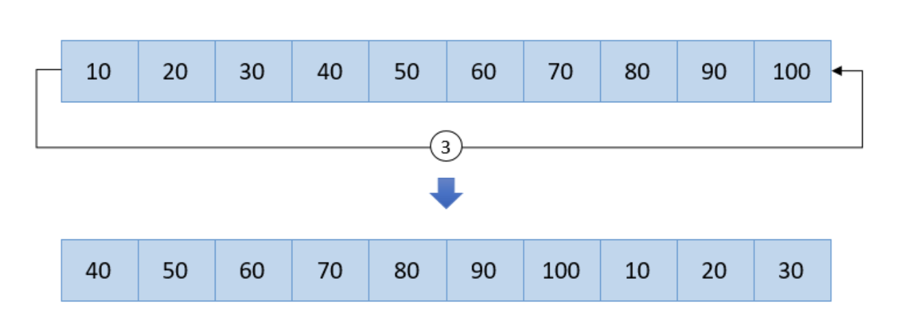

# Ex 11
Escreva um programa que faça o Left shift (rotação para a esquerda) de um array por n casas.

Caso o shift=3



Algoritmo:
- solicita dimensão do array ao user
- Criar o array;
- Pedir ao user cada um dos elementos do array;
- Pedir o valor do shift (quantos elementos irão rodar para a esquerda). Caso valor seja `shift < 0 || shift > dim ` termina apresentando mensagem de erro
- Imprimir array sem left Shift
- Efetuar o left_shift no Array
- Imprimir o array

**Output Esperado**
```console
Insira Dimensão-> 4
insira v[0]->2
insira v[1]->3
insira v[2]->4
insira v[3]->5
Insira Left Shift->2
Array Sem Left Shift:
2 3 4 5
Array com Left Shift:
4 5 2 3

```
