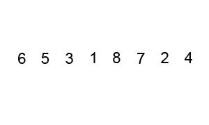

- [Enquadramento](#enquadramento)
- [Bubble Sort](#bubble-sort)
  - [Algoritmo em pseudocódigo](#algoritmo-em-pseudocódigo)
  - [Implementação em c](#implementação-em-c)
- [Insertion Sort](#insertion-sort)
  - [Algoritmo em pseudocódigo](#algoritmo-em-pseudocódigo-1)
  - [Implementação em C](#implementação-em-c-1)
- [Selection Sort](#selection-sort)
  - [Algoritmo em pseudocódigo](#algoritmo-em-pseudocódigo-2)
  - [Implementação em C](#implementação-em-c-2)


# Enquadramento

Em C, existem várias formas de ordenar um vetor de dados. Uma das formas mais comuns é através do algoritmo de ordenação Bubble Sort, que é relativamente simples e fácil de implementar, contudo existem outras que também iremos abordar. Nomeadamente o Selection Sort e o Insertion Sort.

# Bubble Sort

O Bubble Sort funciona comparando cada par de elementos adjacentes do vetor e, caso estejam fora de ordem, trocando-os de lugar. Esse processo é repetido até que o vetor esteja completamente ordenado. Repare na imagem abaixo.



## Algoritmo em pseudocódigo

Deixa-se abaixo duas descrições do algoritmo em pseudocódigo, que apesar de distintas representam a mesma solução de ordenação. O bubble sort:

```markdown
1. Início do Bubble Sort
2. Definir o tamanho do array
3. Para i de 0 até o tamanho do array - 1, faça:
   a. Para j de 0 até o tamanho do array - i - 1, faça:
      i. Se o elemento na posição j for maior que o elemento na posição j+1, então:
         1. Troque os elementos de posição j e j+1
4. Fim do Bubble Sort
```

```text
procedure bubbleSort( A : lista de itens ordenaveis ) defined as:
  do
    trocado := false
    for each i in 0 to length( A ) - 2 do:
      // verificar se os elementos estão na ordem certa
      if A[ i ] > A[ i + 1 ] then
        // trocar elementos de lugar
        trocar( A[ i ], A[ i + 1 ] )
        trocado := true
      end if
    end for
  // enquanto houver elementos sendo reordenados.
  while trocado
end procedure
```

## Implementação em c

```c
void bubble_sort(int vetor[], int dim)
{
    int trocado;
    do
    {
        trocado = FALSO;
        for (int i = 0; i <= ARRAY_LENGHT - 2; i++)
        {
            if (vetor[i] > vetor[i + 1])
            {
                troca(vetor, i, i + 1);
                trocado = VERDADEIRO;
            }
        }

    } while (trocado);//trocado==VERDADEIRO
    return;
}
```

# Insertion Sort

O algoritmo Insertion Sort é um algoritmo de ordenação que percorre o array e compara cada elemento com os elementos à sua esquerda, inserindo o elemento na posição correta dentro do subarray já ordenado. Veja a imagem abaixo:


## Algoritmo em pseudocódigo

Deixa-se abaixo duas descrições do algoritmo em pseudocódigo, que apesar de distintas representam a mesma solução de ordenação. O Insertion sort:

```markdown
1. Início do Insertion Sort
2. Definir o tamanho do array
3. Para i de 1 até o tamanho do array - 1, faça:
   a. Definir o elemento atual como o elemento na posição i
   b. Definir a posição anterior como i - 1
   c. Enquanto a posição anterior >= 0 e o elemento na posição anterior for maior que o elemento atual, faça:
      i. Mover o elemento na posição anterior para a posição anterior+1
      ii. Decrementar a posição anterior
   d. Inserir o elemento atual na posição anterior+1
4. Fim do Insertion Sort
```

```text
function insertionSortR(array A, int n)
    if n > 0
        insertionSortR(A, n-1)
        x ← A[n]
        j ← n-1
        whilej >= 0 and A[j] > x
            A[j+1] ← A[j]
            j ← j-1
        end while
        A[j+1] ← x
    end if
end function
```

## Implementação em C

```c
// A fornecer
```

# Selection Sort

O algoritmo Selection Sort é um algoritmo de ordenação que percorre o array várias vezes, selecionando o menor elemento restante e colocando-o na posição correta. Veja as imagens abaixo


## Algoritmo em pseudocódigo

Deixa-se abaixo duas descrições do algoritmo em pseudocódigo, que apesar de distintas representam a mesma solução de ordenação. O Selection sort:

```markdown
1. Início do Selection Sort
2. Definir o tamanho do array
3. Para i de 0 até o tamanho do array - 2, faça:
   a. Definir o índice do menor elemento como i
   b. Para j de i+1 até o tamanho do array - 1, faça:
      i. Se o elemento na posição j for menor que o elemento na posição do menor elemento, então:
         1. Definir o índice do menor elemento como j
   c. Trocar o elemento na posição i com o elemento na posição do menor elemento
4. Fim do Selection Sort
```

```text
procedure selection sort 
   list  : array of items
   n     : size of list

   for i = 1 to n - 1
   /* set current element as minimum*/
      min = i    
  
      /* check the element to be minimum */

      for j = i+1 to n 
         if list[j] < list[min] then
            min = j;
         end if
      end for

      /* swap the minimum element with the current element*/
      if indexMin != i  then
         swap list[min] and list[i]
      end if
   end for
```

## Implementação em C

```c
// A fornecer
```